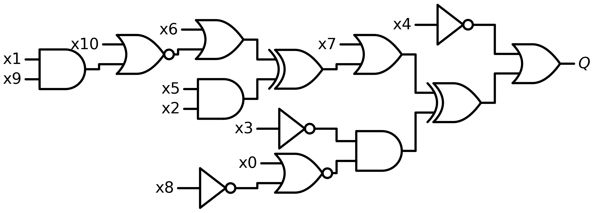
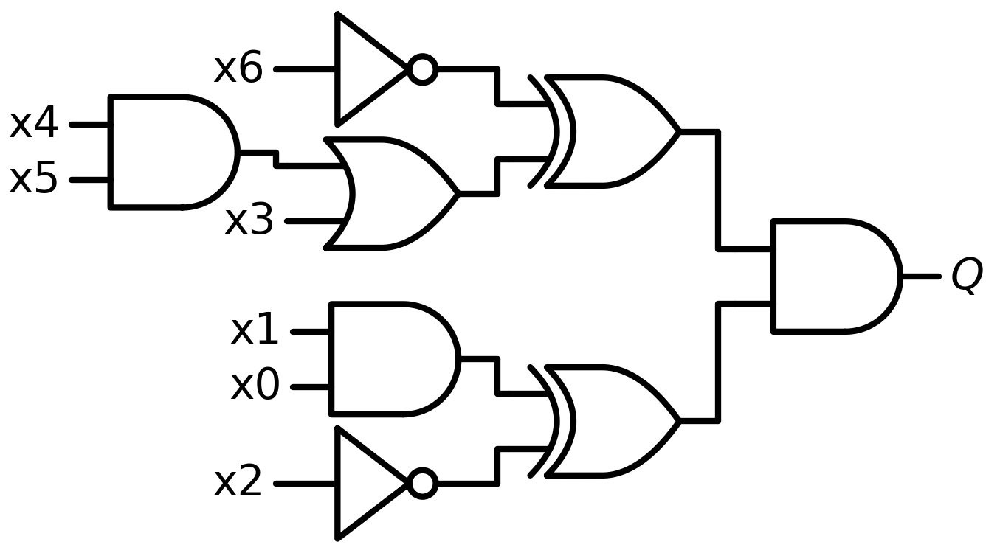
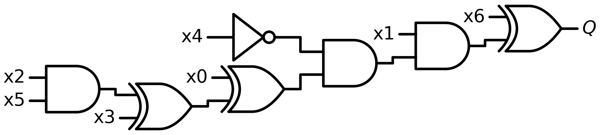
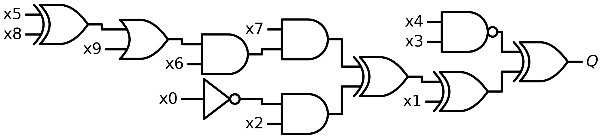

# EP2 — Identificador de circuitos lógicos

O [identificador_circuitos.py](identificador_circuitos.py) analisa imagens de circuitos combinacionais para contar portas lógicas e calcular o valor booleano da saída `Q`. A implementação combina OpenCV, grafos com NetworkX e OCR com Tesseract, usando Qwen2.5-VL-7B-Instruct como alternativa à análise determinística.

[Voltar ao README principal](../README.md)

## Perguntas suportadas

O parser `parse_intent` reconhece os seguintes padrões. Os exemplos em inglês abaixo podem ser usados como perguntas de entrada; as descrições explicam seu significado em português.

| Operação | Exemplo de pergunta | Resposta |
| --- | --- | --- |
| Contagem por tipo | `How many AND gates are in the circuit?` | Quantidade de portas AND, como uma string inteira. |
| Contagem total | `How many total gates are in the circuit?` | Soma das portas detectadas, como uma string inteira. |
| Simulação da saída | `What is the value of Q when x0=True, x1=False?` | `True` ou `False`. |

A contagem por tipo aceita **AND, OR, NOT, NAND, NOR, XOR e XNOR**, incluindo tipos ausentes, cuja contagem é zero. A contagem total também aceita o padrão `How many gates ...`.

Para simulação, informe os valores de todas as entradas do circuito no formato `xN=True` ou `xN=False`. O exemplo curto da tabela ilustra a sintaxe; a quantidade de entradas depende da imagem. O parser ignora diferenças entre maiúsculas e minúsculas, mas não traduz perguntas em português nem reconhece atribuições como `x0=1`.

Perguntas fora desses padrões geram uma operação não suportada.

### Exemplo com o circuito 0

Na imagem [circuit_0.png](circuits/circuit_0.png), as entradas vão de `x0` a `x10`. Exemplos de perguntas:

```text
How many AND gates are in the circuit?
How many NOR gates are in the circuit?
How many total gates are in the circuit?
What is the value of Q when x0=True, x1=True, x2=True, x3=True, x4=True, x5=True, x6=True, x7=True, x8=True, x9=True, x10=True?
```

Pela leitura manual desse diagrama, as respostas esperadas são, respectivamente, `3`, `2`, `13` e `False`. Elas servem como referência para conferir o programa, sem garantir que a extração automática acerte a imagem.

## Imagens de exemplo

A pasta [circuits](circuits/) contém quatro diagramas para visualizar o tipo de imagem analisado. Os nomes seguem o padrão `circuit_<index>.png`, usado pelo código para associar perguntas e imagens.

### Circuito 0



### Circuito 10



### Circuito 100



### Circuito 1000



Essas imagens são exemplos; os arquivos de perguntas e respostas do dataset não estão incluídos nesta pasta.

## Como funciona

1. **Detecção de portas:** binariza a imagem e classifica os contornos pela forma, pelas bolhas de inversão e pela curva adicional das portas XOR/XNOR.
2. **Rastreamento dos fios:** remove os corpos das portas e reduz os fios a esqueletos para reconstruir suas conexões.
3. **Extração do grafo:** representa entradas, portas e saída em um grafo direcionado.
4. **Identificação das entradas:** agrupa caracteres próximos, lê rótulos como `x0` e `x12` com OCR e os associa aos terminais externos.
5. **Resposta:** conta as portas detectadas ou avalia o grafo em ordem topológica com os valores das entradas.

Para contagem, o modelo visual é acionado quando nenhuma porta é detectada. Para simulação, ele é acionado quando o grafo é inválido ou sua avaliação lança uma exceção. Uma extração incorreta que passe pela validação pode produzir uma resposta errada sem acionar o modelo.

## Como executar

### Dependências

As principais bibliotecas importadas pelo arquivo são:

```bash
pip install opencv-python numpy networkx scikit-image torch transformers tokenizers qwen-vl-utils bitsandbytes pytesseract
```

O OCR também precisa do executável **Tesseract**, instalado no sistema. O fallback com Qwen requer acesso aos pesos do modelo e um ambiente compatível com PyTorch, Transformers e a quantização escolhida; a configuração padrão usa 8 bits e foi preparada para execução no Kaggle.

### Uma pergunta sobre uma imagem local

A partir da raiz do repositório, com as dependências disponíveis:

```python
from EP2.identificador_circuitos import answer_single_question

entry = {
    "index": 0,
    "question": "How many AND gates are in the circuit?",
}

answer = answer_single_question(entry, "EP2/circuits")
print(answer)
```

O índice `0` seleciona `EP2/circuits/circuit_0.png`. A função devolve a resposta como texto. Para execução local, ajuste também os caminhos de cache em `CONFIG` para diretórios graváveis, pois os valores padrão apontam para `/kaggle/working`.

### Validação e submissão

O dataset é lido em **JSONL**, com um objeto por linha:

```json
{"index": 0, "question": "How many AND gates are in the circuit?", "answer": "3"}
```

O campo `answer` é necessário para validação e pode ser omitido nos dados de teste. Configure em `CONFIG` os caminhos dos arquivos de perguntas, das pastas de imagens, dos caches e do CSV de saída.

```python
from EP2.identificador_circuitos import (
    CONFIG,
    generate_submission,
    load_caches,
    load_jsonl,
    run_validation,
)

load_caches()

# Validação com as respostas conhecidas do dataset de treino.
train_entries = load_jsonl(CONFIG["train_questions_path"])
run_validation(
    train_entries,
    CONFIG["train_images_dir"],
    max_samples=CONFIG["validation_samples"],
)

# Geração do CSV de respostas para o dataset de teste.
test_entries = load_jsonl(CONFIG["test_questions_path"])
generate_submission(
    test_entries,
    CONFIG["test_images_dir"],
    CONFIG["output_csv_path"],
)
```

A validação informa acurácia por operação e acurácia geral. A submissão gera um CSV com as colunas `index,answer`. O arquivo Python define essas funções, mas não possui um ponto de entrada que as execute automaticamente; executar apenas `python EP2/identificador_circuitos.py` não inicia a validação nem gera a submissão.

## Evolução e limitações

A **versão 3** introduziu a extração determinística do grafo, a contagem de portas e a simulação booleana. As entradas recebiam nomes sequenciais (`x0`, `x1`, …) pela posição, que podiam divergir dos rótulos da imagem.

A **versão 3.1**, presente no código, adiciona OCR para preservar os nomes das entradas e trata cada terminal externo separadamente, evitando que duas entradas da mesma porta sobrescrevam seus rótulos.

Quando um rótulo não é reconhecido ou não está suficientemente próximo do terminal, o código ainda usa um nome sequencial. Isso pode afetar a simulação. A saída é escolhida como a porta sem conexões de saída mais à direita, e a validação estrutural do grafo não garante que todas as conexões tenham sido reconstruídas corretamente.

O README anterior registrava os seguintes resultados para a versão 3: aproximadamente **96% na contagem**, **100/100 imagens com grafo válido** e aproximadamente **60% na simulação**. São resultados históricos, não uma nova medição da versão 3.1 ou das quatro imagens desta pasta.
